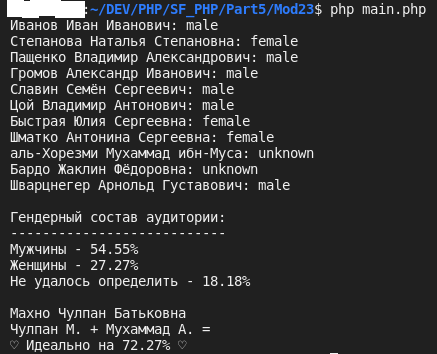

## Курс от SkillFactory

## [Веб версия домашнего задания]()

## **Профессия Веб-разработчик**

## Практическая работа «Создание простейшей страницы-визитки»

### Критерии оценки выполненного задания

**0 баллов** — не решена ни одна задача;

**5 баллов** — верно решена задача «Разбиение и объединение ФИО»;

**10 баллов** — выполнены условия на 5 баллов и верно решена задача «Сокращение ФИО»;

**20 баллов** — выполнены условия на 10 баллов и верно решена задача «Функция определения пола по ФИО»;

**30 баллов** — выполнены условия на 20 баллов и верно решена задача «Определение возрастно-полового состава»;

**40 баллов** — выполнены условия на 30 баллов и верно решена задача «Идеальный подбор пары»;

### Разбиение и объединение ФИО

Разработайте две функции: `getPartsFromFullname` и `getFullnameFromParts`.

`getFullnameFromParts` принимает как аргумент три строки — фамилию, имя и отчество. Возвращает как результат их же, но склеенные через пробел.
Пример: как аргументы принимаются три строки «Иванов», «Иван» и «Иванович», а возвращается одна строка — «Иванов Иван Иванович».

### Сокращение ФИО

Разработайте функцию `getShortName`, принимающую как аргумент строку, содержащую ФИО вида «Иванов Иван Иванович» и возвращающую строку вида «Иван И.», где сокращается фамилия и отбрасывается отчество. Для разбиения строки на составляющие используйте функцию `getPartsFromFullname`.

### Функция определения пола по ФИО

Разработайте функцию `getGenderFromName`, принимающую как аргумент строку, содержащую ФИО (вида «Иванов Иван Иванович»).

### Определение возрастно-полового состава

Напишите функцию `getGenderDescription` для определения полового состава аудитории. Как аргумент в функцию передается массив, схожий по структуре с массивом `$example_persons_array`. Как результат функции возвращается информация в следующем виде:

    Гендерный состав аудитории:
    ---------------------------
    Мужчины - 55.5%
    Женщины - 35.5%
    Не удалось определить - 10.0%

Используйте для решения функцию фильтрации элементов массива, функцию подсчета элементов массива, функцию `getGenderFromName`, округление.

### Идеальный подбор пары

Напишите функцию `getPerfectPartner` для определения «идеальной» пары.

Как первые три аргумента в функцию передаются строки с фамилией, именем и отчеством (именно в этом порядке). При этом регистр может быть любым: ИВАНОВ ИВАН ИВАНОВИЧ, ИваНов Иван иванович.

Как четвертый аргумент в функцию передается массив, схожий по структуре с массивом `$example_persons_array`.

Как результат функции возвращается информация в следующем виде:

    Иван И. + Наталья С. =
    ♡ Идеально на 64.43% ♡

Процент совместимости «Идеально на ...» — случайное число от 50% до 100% с точностью два знака после запятой.

