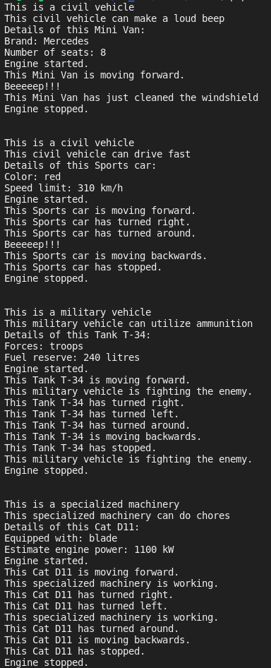

## Курс от SkillFactory

## **Профессия Веб-разработчик**

## Практическое задание №1

Предположим, у нас есть игра в автотематике. У нас есть машины, танки, спецтехника, которые имеют свой набор характеристик, умеют ехать вперед и назад, а некоторые могут даже размахивать ковшом. На основе этой информации постройте классы с использованием абстрактного класса и интерфейса. Напишите принимающую объект машины функцию, которая бы заставляла ее ехать и вызвала одну из способностей машины. Пусть, если это легковое авто, будет закись азота, если это бульдозер, — управление ковшом. Принимающая функция должна быть полиморфной. Необходимо реализовать только структуру.

## Критерии оценки выполненного задания №1

- **0 баллов** — задание не выполнено.

- **5 баллов** — задание выполнено.

- **+5 дополнительных баллов** — вы добавили машинам способность сигналить и включать дворники.

- **+5 дополнительных баллов** — вы добавили машинам элементы индивидуализма, к примеру, отделку салона.

